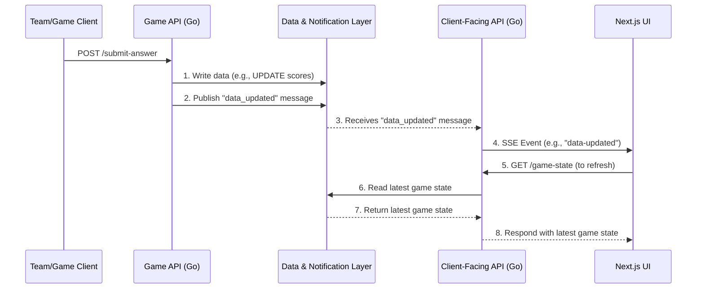

# Architectural Plan: GuessWho Application

This document outlines the approved architectural plan for the GuessWho application, focusing on service separation and the data communication layer.

### 1. API Separation: Two-Service Model

We will proceed with a two-service architecture:

1.  **`guesswhoclientapi` (Client-Facing API):** Responsible for serving read-only game state to the UI and managing Server-Sent Events (SSE) for real-time updates.
2.  **`game-api` (Game Logic API):** A new service responsible for handling write operations, such as processing team submissions and updating scores.

**Rationale:**

*   **Separation of Concerns:** Clear distinction between read-heavy and write-heavy logic.
*   **Independent Scalability:** Each service can be scaled independently based on its specific load.
*   **Technology Flexibility:** The `game-api` can be developed and deployed using its own stack if needed.

**Data Flow Diagram:**

### 2. Data Storage & Communication Layer: Redis

To replace the current in-memory data store and facilitate communication between the two services, we will use **Redis**.

**Implementation:**

1.  Both the `game-api` and `client-api` will connect to a shared Redis instance.
2.  The `game-api` will perform all data writes to Redis.
3.  After a successful write, the `game-api` will publish a message to a Redis Pub/Sub channel (e.g., `game_events`).
4.  The `client-api` will subscribe to this channel. Upon receiving a message, it will trigger an SSE broadcast to all connected clients.

**Rationale:**

*   **Low Complexity:** Go has excellent client libraries for Redis, making the implementation of both data storage and Pub/Sub straightforward.
*   **High Performance:** Redis is designed for high-throughput, low-latency operations, making it ideal for real-time applications.
*   **Cost-Effective:** A single Redis instance can serve as both the primary data store and the messaging bus, providing a very efficient and affordable solution for this architecture.