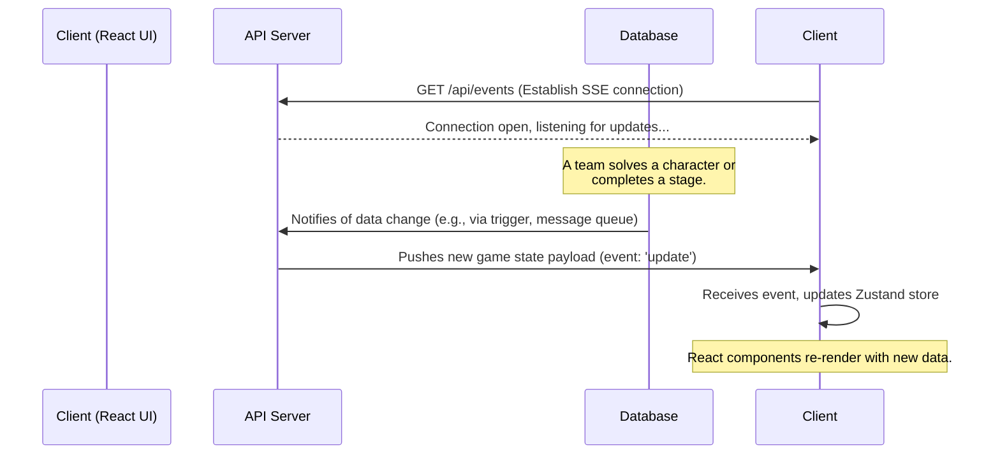
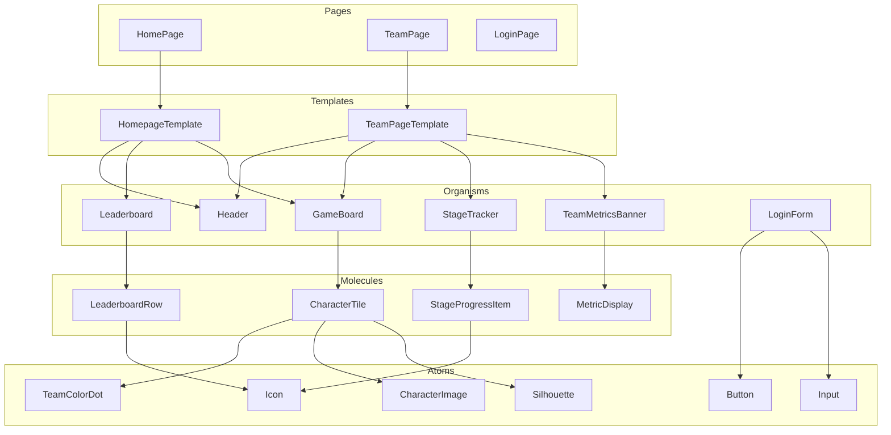

# Project: Guess Who Challenge UI - Architectural Plan

Here is a detailed plan for building the "Guess Who" challenge tracking UI.

## 1. High-Level Architecture

We will use the **Next.js App Router** as our React framework. It's an excellent choice for this project because it provides a great developer experience, a robust routing system, and performance optimizations out-of-the-box, even for a client-heavy SPA like this one.

*   **Framework**: **Next.js 14+** (with App Router)
*   **Language**: **TypeScript** (for type safety and maintainability)
*   **Styling**: **Tailwind CSS**. It's a utility-first CSS framework that pairs perfectly with component-based architecture and allows for rapid, consistent styling.
*   **State Management**:
    *   **Zustand**: For managing global client-side state, such as the logged-in team's data and the live game state. It's a simple, unopinionated, and powerful state management library.
    *   **SWR (or React Query)**: For data fetching, caching, and re-validation. It will simplify fetching data from the API and help keep our UI in sync with the backend.

## 2. Live Update Strategy (Real-time Sync)

A key requirement is that the UI updates in real-time as teams make progress. Polling the API every few seconds is inefficient and doesn't provide a great user experience.

We will use **Server-Sent Events (SSE)**. This is a standard web technology where the server can push data to the client as soon as an event occurs. It is simpler to implement than WebSockets and is perfect for our use case, as we only need one-way communication (server to client) for the live updates.

Here is how it would work:



This approach is highly efficient and scalable, especially when deployed on modern cloud infrastructure (AWS/GCP).

## 3. API Assumptions

The provided `solution_doc.md` details the API for the *participants*. For our UI, we will need a corresponding set of backend-for-frontend (BFF) endpoints. We will assume the following API endpoints will be available for the UI to consume:

*   `POST /api/auth/signup` - Creates a new team account.
*   `POST /api/auth/login` - Authenticates a team and returns a JWT.
*   `POST /api/auth/logout` - Invalidates the session.
*   `GET /api/auth/me` - Returns the currently logged-in team's data.
*   `GET /api/game/state` - Returns the complete state of the game board (which characters are solved by which teams).
*   `GET /api/game/leaderboard` - Returns the top 5 teams for the leaderboard.
*   `GET /api/team/progress` - Returns detailed progress for the logged-in team (for their team page).
*   `POST /api/team/reset` - The "Reset Board" functionality.
*   `GET /api/events` - The SSE endpoint for live updates.

## 4. Component Architecture (Atomic Design)

We will structure our components following the Atomic Design methodology to ensure they are reusable and well-organized.



**Component Breakdown:**

*   **Atoms:**
    *   `Button`: For all clickable actions (Login, Signout, Reset).
    *   `Input`: Text fields for forms.
    *   `Icon`: SVG icons for ticks, spinners, etc.
    *   `Silhouette`: The default character placeholder.
    *   `CharacterImage`: The revealed character image.
    *   `TeamColorDot`: The small colored dot overlaid on a silhouette.
*   **Molecules:**
    *   `CharacterTile`: A single square on the game board, which can show a silhouette, a revealed image, and team dots.
    *   `LeaderboardRow`: A single row in the leaderboard table.
    *   `StageProgressItem`: An item in the stage tracker list (e.g., "✓ M4 — Encrypted Answer Handled").
    *   `MetricDisplay`: A single metric in the team banner (e.g., "Current Stage: M5").
*   **Organisms:**
    *   `Header`: The top navigation bar, which will conditionally render Login/Signup or Team Page/Signout buttons.
    *   `GameBoard`: The 8x8 grid of `CharacterTile` components.
    *   `Leaderboard`: The table displaying the top 5 teams.
    *   `TeamMetricsBanner`: The banner on the team page with all their key stats.
    *   `StageTracker`: The list of milestones and the team's progress through them.
    *   `LoginForm` / `SignupForm`: The forms for authentication.
*   **Templates & Pages:**
    *   These will compose the organisms into the final page layouts for the `HomePage`, `TeamPage`, `LoginPage`, etc.

## 5. Project Structure

I will set up the project with the following directory structure within a `src/` directory:

```
/src
├── app/                  # Next.js App Router (Pages)
│   ├── (auth)/           # Auth pages group
│   │   ├── login/page.tsx
│   │   └── signup/page.tsx
│   ├── team/page.tsx     # Team Page
│   └── page.tsx          # Homepage
│   └── layout.tsx        # Root layout
├── components/           # Atomic Design components
│   ├── atoms/
│   ├── molecules/
│   └── organisms/
├── hooks/                # Custom React hooks (e.g., useLiveUpdates)
├── lib/                  # Helper functions, API client
├── store/                # Zustand store setup
└── styles/               # Global styles