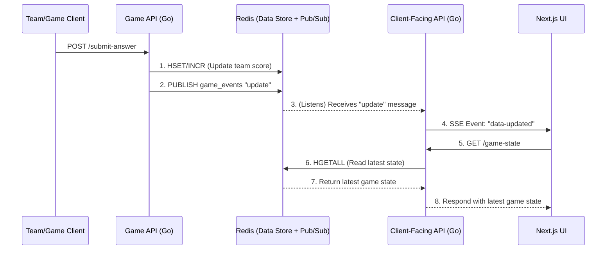

# Architectural Recommendation: Service Separation & Data Storage

This document provides architectural recommendations for the GuessWho application, focusing on the separation of services and the selection of a data storage solution to support real-time updates.

## 1. Background

The application consists of a Next.js UI (`guesswhoui`), a client-facing Go API (`guesswhoclientapi`), and a forthcoming "game API" for team submissions. A critical requirement is that data updates made via the game API must be instantly communicated to the client-facing API to trigger Server-Sent Events (SSE) to the UI. The strong preference is to maintain two separate API services.

## 2. API Separation Analysis

The core architectural decision is whether to keep the client-facing and game APIs separate or merge them into a monolith.

### A. Separated Two-Service Approach (Recommended)

This approach involves two distinct services:
1.  **Client-Facing API:** Handles authentication, serves public game state, and manages SSE connections with UI clients. Primarily a read-heavy service.
2.  **Game API:** Handles team submissions, validates answers, and updates the central data store. A write-heavy service.

**Pros:**
*   **Clear Separation of Concerns:** Isolates the logic for reading game state from the logic for modifying it. This simplifies development and maintenance for each service.
*   **Independent Scalability:** The write-heavy game API can be scaled independently from the read-heavy client API, allowing for more efficient resource allocation.
*   **Enhanced Security:** The attack surface is reduced. The more complex, write-enabling game API can have stricter access controls and does not need to be as publicly exposed as the client-facing API.
*   **Technology Flexibility:** The two services can be built and deployed using different technology stacks if future requirements dictate.

**Cons:**
*   **Inter-Service Communication:** Requires a robust mechanism for the two services to communicate. This is the primary challenge this document addresses.
*   **Operational Overhead:** Slightly more complex to deploy and monitor two services instead of one.

### B. Monolithic Approach

A single API service would handle all responsibilities: serving the UI, managing SSE connections, and processing game submissions.

**Pros:**
*   **Simplicity:** Easier to develop and deploy initially, as there is no need for inter-service communication.

**Cons:**
*   **Tight Coupling:** All components are intertwined, making the codebase harder to manage and scale as it grows.
*   **Scalability Issues:** The entire application must be scaled as a single unit, which is inefficient. A spike in game submissions could degrade the performance of the client-facing endpoints.
*   **Single Point of Failure:** An issue in one part of the monolith can bring down the entire application.

**Conclusion:** The separated two-service approach is the optimal strategy. It aligns with the project's preference and provides a more scalable, maintainable, and resilient architecture for the long term.

## 3. Data Storage & Communication Solution

The central challenge of the two-service model is bridging the communication gap. The `guesswhoclientapi`'s current in-memory store is insufficient. The chosen solution must provide both data persistence and a real-time notification mechanism.

### Final Recommendation: Redis (for Data Store & Pub/Sub)

**Redis is the recommended solution.** It will serve as both the central data store (replacing the in-memory maps) and the messaging bus for inter-service communication.

**Implementation Diagram:**

**Analysis:**
*   **Implementation Complexity: Low.** Go has mature, high-performance Redis clients. The logic for both data manipulation (e.g., `HSET`, `INCR`) and messaging (`PUBLISH`, `SUBSCRIBE`) is simple and well-documented.
*   **Scalability: Excellent.** Redis is an industry standard for high-performance, low-latency applications. It can handle millions of operations per second, making it more than capable of supporting this project's growth.
*   **Cost-Effectiveness: High.** A single, small managed Redis instance is inexpensive and fulfills two critical architectural roles (database and message broker), offering exceptional value.

### Alternatives Considered

#### A. PostgreSQL with LISTEN/NOTIFY

*   **Description:** Use PostgreSQL as the primary database. A trigger on the data table would execute `NOTIFY` on a channel, which the client API would `LISTEN` for.
*   **Analysis:** While viable, this approach is more complex to manage. It requires careful handling of persistent database connections for the `LISTEN` command, which can be brittle and adds extra load to the relational database. For this use case, Redis provides a more direct and purpose-built solution.

#### B. MongoDB Atlas with Change Streams

*   **Description:** Use MongoDB as the database and have the client API subscribe to a Change Stream on the relevant collections.
*   **Analysis:** This is a powerful feature and works very well. However, it is specific to MongoDB and often requires a replica set configuration, which can increase cost and complexity compared to the Redis solution.

## 4. Summary

The final recommendation is to:
1.  **Adopt a two-service architecture**, separating the `client-facing API` from the `game API`.
2.  **Utilize Redis** as the unified data store and real-time messaging bus, using its **Pub/Sub feature** to trigger SSE updates.

This architecture is robust, scalable, and cost-effective, and it directly solves the core requirement of providing real-time updates in a distributed system.